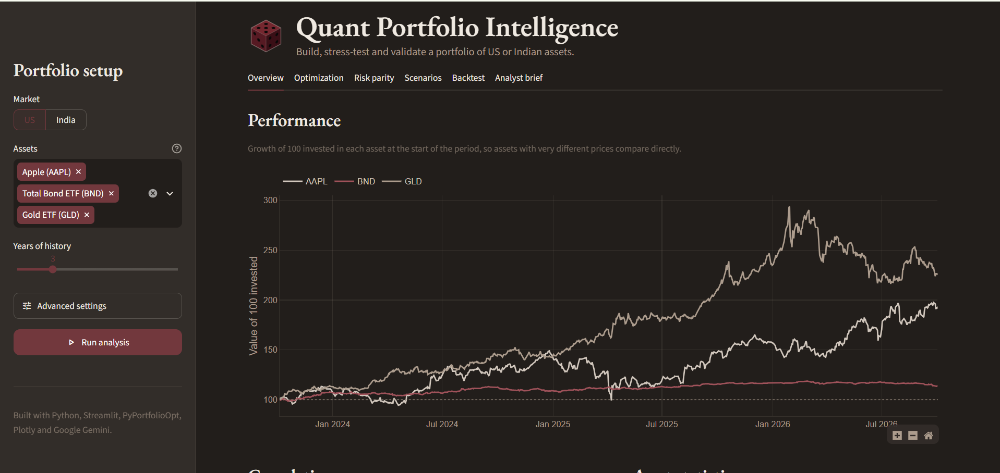

# Quant Portfolio Intelligence

An interactive dashboard for building, stress-testing and validating a portfolio of US or Indian assets. Pick the assets, and it works out how to combine them, how risky the mix is, how it might behave over the next year, and whether the optimized weights hold up on data they were never fitted to.

**Live demo:**https://quant-portfolio-intelligence.streamlit.app/



## Why this project

Most investors choose *what* to buy and then split their money by gut feel. This dashboard focuses on the second question: given a set of assets, what is a sensible way to combine them? It brings together the standard tools portfolio managers use to answer that (mean-variance optimization, risk parity, Monte Carlo simulation and out-of-sample testing) in one place, with plain-English explanations alongside the numbers.

It is not a stock screener and does not recommend what to buy.

## Features

| Tab | What it shows |
|---|---|
| **Overview** | Growth of 100 invested in each asset, a correlation heatmap, and annualized return and volatility per asset |
| **Optimization** | Maximum Sharpe and minimum variance portfolios (Markowitz mean-variance optimization), plotted on the efficient frontier with each asset and strategy marked |
| **Risk parity** | An allocation where every asset contributes an equal share of total risk, with a chart confirming the risk contributions come out equal |
| **Scenarios** | 1,000 simulated one-year paths (Monte Carlo) showing the median, 5th and 95th percentile outcomes and the chance of a loss |
| **Backtest** | Weights are fitted on the earlier part of the history only, then tested on a later period the optimizer never saw, compared against an equal-weight benchmark |
| **Analyst brief** | A short plain-English summary of the results, written by Google Gemini from figures the app has already calculated |

Other details:

- Works with **US stocks and ETFs** (e.g. `AAPL`, `BND`, `GLD`) and **Indian NSE stocks** (e.g. `RELIANCE.NS`, `TCS.NS`), with currency labels and a sensible default risk-free rate for each market.
- Pick assets from a list or type any Yahoo Finance ticker.
- Tickers with missing data are skipped with a warning, rather than crashing the app.
- If no asset beats the risk-free rate, the app explains why a maximum Sharpe portfolio doesn't exist instead of showing a meaningless result.

## How it works

1. **Data.** Daily closing prices are downloaded from Yahoo Finance. Daily returns are annualized into expected returns, volatilities and a correlation matrix.
2. **Optimization.** PyPortfolioOpt solves for the maximum Sharpe and minimum variance weights (long-only, fully invested) and traces the efficient frontier.
3. **Risk parity.** A SciPy optimizer finds weights where each asset's contribution to portfolio volatility is equal.
4. **Simulation.** Correlated daily returns are drawn from a multivariate normal distribution using the historical means and covariances, then compounded over 252 trading days, 1,000 times. A fixed random seed keeps results stable between reruns.
5. **Validation.** The price history is split into a training window and a test window. Weights fitted on the training window are held fixed through the test window and compared with an equal-weight mix.

## Tech stack

- **Python**
- **Streamlit** for the web app
- **yfinance** for market data
- **pandas** and **NumPy** for data handling
- **PyPortfolioOpt** for mean-variance optimization
- **SciPy** for risk parity
- **Plotly** for interactive charts
- **Google Gemini API** for the analyst brief

## Project structure

```
quant-portfolio/
├── main.py                    # Streamlit app: sidebar, tabs and layout
├── modules/
│   ├── data_loader.py         # Downloads prices, computes returns and statistics
│   ├── portfolio_analyzer.py  # Return, volatility, Sharpe, VaR, max drawdown
│   ├── optimizer.py           # Max Sharpe, min variance, efficient frontier
│   ├── simulation.py          # Risk parity weights and Monte Carlo simulation
│   ├── backtester.py          # Out-of-sample train/test backtest
│   ├── narrative.py           # Gemini-written analyst brief
│   └── ui.py                  # Colours, fonts, logo and chart styling
├── .streamlit/
│   └── config.toml            # Dark theme
└── requirements.txt
```

Each module does one job, and `main.py` only handles layout, so the analytics can be tested or reused without the interface.

## Running it locally

```bash
git clone https://github.com/samhithasharon9-xyz/quant-portfolio-dashboard.git
cd quant-portfolio-dashboard

python -m venv venv
venv\Scripts\activate          # Windows
# source venv/bin/activate     # macOS / Linux

pip install -r requirements.txt
streamlit run main.py
```

The app opens at `http://localhost:8501`.

### Optional: AI analyst brief

The brief uses the Google Gemini API, which has a free tier. Get a key from [Google AI Studio](https://aistudio.google.com), then create `.streamlit/secrets.toml`:

```toml
GEMINI_API_KEY = "your-key-here"
```

This file is listed in `.gitignore` and should never be committed. Everything else in the app works without a key.

## Limitations

- Expected returns and risk are estimated from past prices, which are a weak guide to future returns. Results change noticeably with the time window chosen.
- The Monte Carlo simulation assumes normally distributed returns, which understates extreme market moves.
- The backtest uses a single train/test split and ignores transaction costs and taxes.
- Mixing US and Indian assets combines USD and INR prices without currency conversion. Percentage-based results are still valid, but money values use a single currency label.

## Disclaimer

This project is for learning and demonstration only. It is not investment advice.
